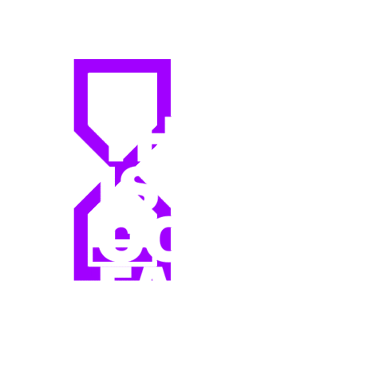

    

        <h1 style="height: 135px; font-size: 40px">Hi I'm</h1>
        
        
    

    

        
    

    

        
    

    

        I'm a beginner <b>Node.js</b> backend developer from Ukraine . 
        I love to explore new technologies, solve challenging problems. My journey in the world of programming started in 2021, and I haven't stopped learning and growing since then.
    

## 🔎 You can find me here:

    

        <ul style="font-weight: bold; font-size: 18px; width: 100%">
            <li>
                <a style="display: flex; align-items: center; color: #ff5c7f; gap: 15px" href="https://www.instagram.com/_what_is_lovechik_/">Instagram </a>
            </li>
            <li style="margin-top: 5px">
                <a style="display: flex; color: #ff5c7f; align-items: center; gap: 15px" href="https://t.me/what_is_lovechik">Telegram </a>
            </li>
            <li style="margin-top: 5px">
                <a style="display: flex; color: #ff5c7f; align-items: center; gap: 15px" href="mailto:vladgeina@gmail.com">Gmail </a>
            </li>
            <li style="margin-top: 5px">
                <a style="display: flex; color: #ff5c7f; align-items: center; gap: 15px" href="https://www.sololearn.com/profile/24780393">SoloLearn </a>
            </li>
            <li style="margin-top: 5px">
                <a style="display: flex;color: #ff5c7f; align-items: center; gap: 15px" href="https://ua.udemy.com/user/vladyslav-geyna/">Udemy </a>
            </li>
        </ul>
    

    

        
    

## 💻 My skills:
<ul>
    <li>
        <h4>My main stack of technologies:</h4>
        

            
            
            
            
            
            
            
            
            
            
        

    </li>
    <li>
        <h4>Also my skills include a basic knowledge of:</h4>
        

            
            
            
        

    </li>
    <li>
        <h4>What I'm going to learn or improve:</h4>
        

            
            
            
            
            
            
            
        

    </li>
</ul>

Consider giving my work some ⭐ :)

